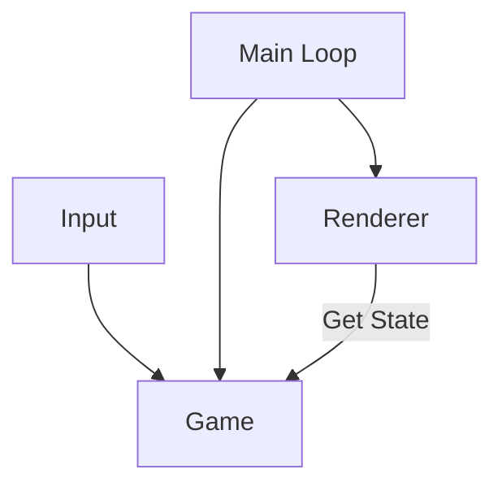

# Fruit Collector Game

Fruit is spawn from above, catch it, you only have 3 chance to fail!


## Diagram



## Installation

1. Install node dependencies
```shell
npm ci
```

2. Build
```shell
npm run build
```

3. Copy html file
```shell
cp src/index.html dist/index.html
```

4. Open the dist/index.html

## Docker Build

1. Build image
```sh
docker build -t game-fruit-collector .
```

3. On your directory, open the ./dist/index.html

## TODOs

- Add: more level
- Feat: Refresh when over
- Feat: Choose difficulty
- Feat: Custom configuration
- Add: Different types of fruit
- Add: Different types of basket (player)
- Feat: Multiplayer duel
